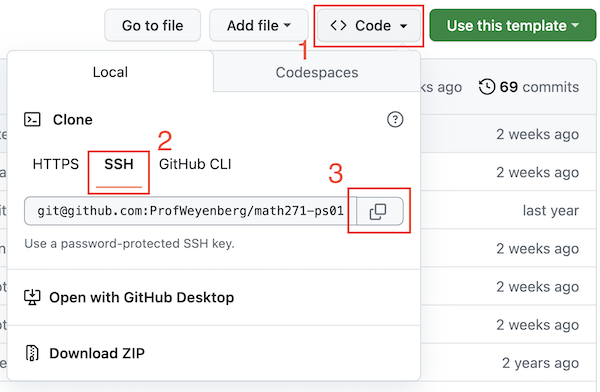
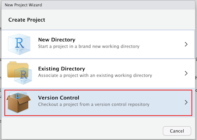
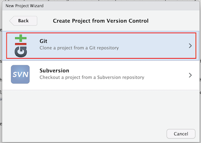
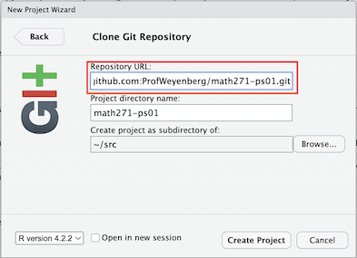

## Cloning an assignment project

RStudio organizes work into "Projects", which are mostly just folders in the file system plus a few settings. You can create projects from scratch, but many of the assignments in this course will be "cloned" from a template on Github. 

- Find the link to a Github Classroom Assignment on Laulima. The first time you use one of these links you will need to pair your github account account to a name in the class roster. After that everything should be automatic. 

- Visit your new assignment repository, which should have opened after using the assignment link, go to the green "Code" button and copy the clone URL by clicking the copy button next to it. (**Make sure that you select the "SSH" link before copying.** It should begin with `git@github.com`)

- Return to RStudio and open the project drop down menu in the top right and select New Project. You can also go to File > New Project.

- Select "Version Control", then "Git". 

- Paste the Clone URL from the last step into the Repository URL area Make sure directory field is automatically filled by pressing tab or one of the arrow keys after pasting the URL. You may accept the default subdirectory location, or choose another location to download the project files if you wish.

You should now be set up with a new R project which is copied from the template on github. Everything should also be automatically configured for you to eventually submit your work back to github when you are finished. Press **"Create Project"**.

Now you have a copy of the assignment and are ready to being completing it. . Open the `PS02_data_viz.Rmd` file in the **Files** pane in the lower right to continue the tutorial.
